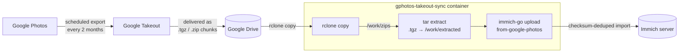

# gphotos-takeout-sync

> Automated, idempotent mirror of a **Google Photos** library into a self-hosted **Immich** server, via **Google Takeout** + `rclone` + `immich-go`.

[](https://github.com/jasonm4130-labs/gphotos-takeout-sync/actions/workflows/build.yml)
[](https://github.com/jasonm4130-labs/gphotos-takeout-sync/pkgs/container/gphotos-takeout-sync)
[](LICENSE)

A small Alpine container that periodically pulls your scheduled Google Takeout
archives down from Google Drive, extracts them, and imports them into Immich —
deduplicating against what is already on the server. It **fails loud**: every run
writes a machine-readable metrics file so a wedged or broken sync never goes
unnoticed.

---

## Why this exists

On **2025-03-31**, Google removed the Photos Library API read scope
(`photoslibrary.readonly`) that third-party tools relied on for full-library
access. This broke `rclone`'s Google Photos backend and every tool like it.

The only reliable, supported path to bulk-export a Google Photos library today is
**Google Takeout** — and Takeout can be **scheduled** (every 2 months, for a
year) with delivery straight to **Google Drive** as multi-GB archive chunks.
This image automates the *second half* of that pipeline: it watches Drive, pulls
the chunks, and feeds them into Immich. (You still configure the Takeout export
itself once, in Google's UI — see [Setup](#setup).)

---

## How it works



1. **Google Takeout** is configured (once) to export Photos every 2 months to **Google Drive**.
2. On a cron schedule, the container runs `rclone copy` to pull new archive chunks from Drive into `/work/zips`.
3. `.tgz`/`.tar.gz` chunks are **extracted** into `/work/extracted` (immich-go reads folders and `.zip`, not tarballs); `.zip` archives are passed through as-is.
4. `immich-go upload from-google-photos` imports the result into Immich. Imports are **idempotent** — assets already on the server are skipped by checksum, so re-runs are safe.
5. Local staging (`/work/zips`, `/work/extracted`) is cleaned up after a successful real run. The source archives **stay in Google Drive** — rclone `copy` never deletes them.

The container bundles:

| Tool | Role |
|------|------|
| [`rclone`](https://rclone.org) | Pulls Takeout archives down from Google Drive |
| [`immich-go`](https://github.com/simulot/immich-go) `v0.31.0` | Imports Takeout into Immich (albums, EXIF, dates from JSON sidecars) |
| [`supercronic`](https://github.com/aptible/supercronic) | Cron scheduler with proper exit-code logging to stdout |
| `su-exec` / `tini` | Drops privileges to `PUID:PGID`; clean init/signal handling |

---

## Quick start

### 1. `docker run` (one-shot backfill of a local folder)

Use this for the **initial bulk import** of an already-downloaded, already-extracted
Takeout, with no rclone involved. Start with `DRY_RUN=1` to preview:

```bash
docker run --rm --network immich_default \
  -e DRY_RUN=1 \
  -e IMMICH_SERVER=http://immich-server:2283 \
  -v /path/to/extracted/takeout:/backfill:ro \
  -v /path/to/immich_api_key.txt:/run/secrets/immich_api_key:ro \
  ghcr.io/jasonm4130-labs/gphotos-takeout-sync:latest backfill
```

Drop `-e DRY_RUN=1` for the real import. Point `--network` at whatever Docker
network reaches your Immich server (commonly `immich_default` for a stock Immich
Compose deployment).

### 2. `docker-compose.yml` (scheduled Drive sync — the normal case)

```yaml
services:
  gphotos-takeout-sync:
    image: ghcr.io/jasonm4130-labs/gphotos-takeout-sync:0.1.5
    container_name: gphotos-takeout-sync
    environment:
      SYNC_SOURCE: drive
      IMMICH_SERVER: http://immich-server:2283
      RCLONE_REMOTE: gdrive:Takeout          # rclone remote:path holding your Takeout
      CRON_SCHEDULE: "0 4 5 */2 *"           # 04:00 on the 5th, every 2nd month
      TZ: Australia/Melbourne
      PUID: 99                               # match the owner of your /work volume
      PGID: 100                              # (use `id -u` / `id -g` on Linux hosts)
      UMASK: "002"
      # DRY_RUN: "1"                         # uncomment to preview without writing
    volumes:
      - gphotos_work:/work                   # persists state/, .cache/, staging
    secrets:
      - immich_api_key
      - rclone_conf
    networks:
      - immich                               # must reach IMMICH_SERVER
    restart: unless-stopped
    healthcheck:
      # liveness of the scheduler process (matches the image default); run
      # freshness is a monitoring concern, not container health (see Monitoring)
      test: ["CMD-SHELL", "pidof supercronic >/dev/null 2>&1 || exit 1"]
      interval: 5m
      timeout: 10s
      retries: 3
      start_period: 30s

volumes:
  gphotos_work:

secrets:
  immich_api_key:
    file: ./secrets/immich_api_key.txt       # contents: your Immich API key, no newline
  rclone_conf:
    file: ./secrets/rclone.conf              # contents: your rclone config (the gdrive remote)

networks:
  immich:
    external: true                           # the network your Immich stack created
    name: immich_default
```

> **Network note:** the container only needs to reach your Immich server's API
> (`IMMICH_SERVER`) and the internet (for Google Drive). Attach it to whichever
> network your Immich deployment exposes; `immich_default` is the default for a
> stock Immich Compose stack. There is no web UI to expose.

---

## Setup

You need three things wired up before the first scheduled run: an **Immich API key**,
an **rclone config** authenticated to Google Drive, and a **scheduled Google Takeout**.

### 1. Immich API key

In the Immich web UI: **Account Settings → API Keys → New API Key**. Copy it into the secret file (no trailing newline):

```bash
mkdir -p secrets
printf '%s' 'YOUR_IMMICH_API_KEY' > secrets/immich_api_key.txt
```

### 2. rclone config for the Google Drive remote

rclone's Google Drive auth is an interactive OAuth flow that **cannot run inside
the container** — generate the config on a machine with a browser, then ship the
resulting file in as a secret.

```bash
# On your host (anywhere with rclone + a browser):
rclone config
#   n) New remote
#   name> gdrive          <-- the remote name; matches the gdrive: in RCLONE_REMOTE
#   Storage> drive        <-- Google Drive
#   ... follow the OAuth prompts (use "auto config" with a browser) ...

# Verify it can see your Takeout folder:
rclone ls gdrive:Takeout

# Copy the config in as the secret:
cp ~/.config/rclone/rclone.conf secrets/rclone.conf
```

`RCLONE_REMOTE` (default `gdrive:Takeout`) is `<remote-name>:<path>`. If your
Takeout lands somewhere other than a top-level `Takeout` folder, point this at the
right path.

> The rclone config contains a **live OAuth refresh token** — treat the file like
> a password. The container re-stages a `0600` copy that rclone can write refreshed
> tokens to (see [Security](#security)).

### 3. Scheduled Google Takeout → Drive

Configure the export once at [takeout.google.com](https://takeout.google.com):

1. **Deselect all**, then select **Google Photos** only.
2. Click **Next step**.
3. Delivery method: **Add to Drive**.
4. Frequency: **Export every 2 months for 1 year** (6 exports).
5. File type: **.zip** or **.tgz** (both are handled), and a chunk size (e.g. 10 GB or 50 GB).
6. **Create export.**

Google emails you each time an incremental export is ready and drops the archive
chunks into your Drive. The default `CRON_SCHEDULE` (`0 4 5 */2 *`) is timed to run
shortly after those bi-monthly exports land — adjust it to match your export cadence.

---

## Modes

Two independent dimensions control behaviour: the **container command** and, in cron
mode, the **sync source**.

### Container command (first CMD arg)

| Command | Behaviour |
|---------|-----------|
| `cron` (default) | Writes a crontab from `CRON_SCHEDULE` and runs `sync.sh ${SYNC_SOURCE}` on schedule under supercronic. The long-running scheduled mode. |
| `backfill` | One-shot import of `LOCAL_PATH` (default `/backfill`), then exits. **Always** runs a local import — `SYNC_SOURCE` is ignored. No rclone. |
| *(anything else)* | Debug passthrough — runs the given command as the unprivileged `PUID:PGID` user. |

### Sync source (`SYNC_SOURCE`, cron mode only)

| Source | Behaviour |
|--------|-----------|
| `drive` (default) | `rclone copy ${RCLONE_REMOTE}` → `/work/zips`, extract tarballs, then `immich-go` import. |
| `local` | `immich-go` import of `${LOCAL_PATH}` directly (no rclone). Same logic the `backfill` command uses, but on a schedule. |

In short: `backfill` is the one-shot equivalent of scheduled `SYNC_SOURCE=local`.

---

## Configuration

Every environment variable the code reads, with its default and meaning:

| Env | Default | Purpose |
|-----|---------|---------|
| `SYNC_SOURCE` | `drive` | `drive` (rclone from Drive) or `local` (import a local folder). Used as the `sync.sh` arg in cron mode. |
| `IMMICH_SERVER` | `http://immich-server:2283` | Immich API base URL. |
| `RCLONE_REMOTE` | `gdrive:Takeout` | rclone `remote:path` source for `drive` mode. |
| `LOCAL_PATH` | `/backfill` | Source folder for `local`/`backfill` import. |
| `CRON_SCHEDULE` | `0 4 5 */2 *` | supercronic schedule (cron mode). |
| `DRY_RUN` | `0` | Set to `1` to add `immich-go --dry-run` (no assets written, staging not cleaned up). Declared as `0` in the image `ENV`; the code also falls back to `0`. |
| `WORK_DIR` | `/work` | Working/state root. Holds `zips/`, `extracted/`, `state/`, and immich-go's `.cache/`. |
| `IMMICH_API_KEY_FILE` | `/run/secrets/immich_api_key` | Path to the Immich API key secret. Overridden internally to the re-staged copy at runtime (see [Security](#security)). |
| `RCLONE_CONF_FILE` | `/run/secrets/rclone_conf` | Path to the rclone config secret. Overridden internally to the re-staged copy at runtime. |
| `PUID` | `99` | Run-user UID. Match the owner of your `/work` volume (Unraid `nobody`). |
| `PGID` | `100` | Run-user GID. Match the group of your `/work` volume (Unraid `users`). |
| `UMASK` | `002` | umask for created files. |
| `TZ` | *(unset → UTC)* | Container timezone (affects cron firing time and log timestamps; `tzdata` is bundled). |

Secrets are read from **files only, never env vars**, Docker-secret style:

- `/run/secrets/immich_api_key` — the Immich API key.
- `/run/secrets/rclone_conf` — the rclone config containing the Google Drive remote (`drive` mode only).

`immich-go` is always invoked with `--include-unmatched=true`, so media without a
JSON sidecar still imports.

---

## Monitoring

After every run, `sync.sh` atomically writes `/work/state/metrics` as `KEY=VALUE`
lines, suitable for Telegraf's `inputs.exec`, a Prometheus textfile collector, or a
shell healthcheck:

```ini
gphotos_sync_exit_code=0
gphotos_sync_assets_imported=1234
gphotos_sync_last_success=1718600000
gphotos_sync_last_run=1718600000
```

| Key | Meaning |
|-----|---------|
| `gphotos_sync_exit_code` | `0` if the last run succeeded, `1` if it failed. |
| `gphotos_sync_assets_imported` | Best-effort count parsed from immich-go's summary. Advisory only — format varies by immich-go version. |
| `gphotos_sync_last_success` | Unix epoch of the last **successful** run. Preserved across failed runs so a staleness alert stays meaningful. |
| `gphotos_sync_last_run` | Unix epoch of the last run (success or failure). |

The full immich-go output of the most recent run is teed to
`/work/state/last-import.log` — your first stop when a run fails.

**Recommended alerts:**

- **Failure:** `gphotos_sync_exit_code != 0`.
- **Staleness:** `now - gphotos_sync_last_success` exceeds your export cadence (e.g. > 65 days for a bi-monthly schedule) — catches a cron that silently stopped firing.
- **Zero-growth (soft):** `gphotos_sync_assets_imported == 0` across several runs — a weak signal that something upstream (Takeout/Drive) dried up.

Example Telegraf scrape:

```toml
[[inputs.exec]]
  commands = ["cat /work/state/metrics"]
  data_format = "value"          # or parse KEY=VALUE per your collector
  name_override = "gphotos_sync"
```

---

## Security

- **Non-root by design.** The entrypoint runs briefly as root only to fix `/work`
  ownership and stage secrets, then drops to `PUID:PGID` via `su-exec` for the
  actual workload (cron, rclone, immich-go).
- **File secrets, not env vars.** Credentials are read from files under
  `/run/secrets`, never from environment variables — `docker inspect` exposes env
  but not file contents.
- **Secret re-staging.** Docker Compose (non-swarm) bind-mounts file secrets as
  `0600 root:root`, which the unprivileged run user cannot read. The entrypoint
  copies them to `/tmp/secrets` as `0600 PUID:PGID` (writable so rclone can persist
  refreshed OAuth tokens) and points the job at those copies. These copies live only
  in the container's ephemeral layer and vanish on recreate; your host secrets stay
  `root:root 0600`.
- **The rclone config is a live credential.** It carries a Google OAuth refresh
  token — treat `rclone.conf` exactly like a password.
- **`HOME` is set to the work dir.** immich-go (via Go's `os.UserCacheDir`) writes
  to `$HOME/.cache`. The run user has no home directory, so without this it would
  fall back to root-owned `/.cache` and die with `mkdir /.cache: permission denied`.
  Pointing `HOME` at `WORK_DIR` keeps the cache under `/work/.cache`, where it
  persists across the drive-mode staging cleanup.

---

## Versioning & releases

Releases follow **semver** and are fully CI-driven:

1. Tag a version: `git tag v0.1.4 && git push origin v0.1.4`.
2. The [`build-and-push`](.github/workflows/build.yml) GitHub Actions workflow builds the image on a **Blacksmith** runner.
3. The image is pushed to **GHCR**: `ghcr.io/jasonm4130-labs/gphotos-takeout-sync`.

The `docker/metadata-action` **strips the leading `v`**, so tag `v0.1.4` publishes
image tag `0.1.4` (plus `0.1`, a `sha-<short>` tag, and `latest` for the highest
non-prerelease semver). **Current version: `v0.1.5`.**

Bump the **minor** version for breaking env-var or behaviour changes; **patch** for
fixes and dependency bumps.

---

## Troubleshooting

| Symptom | Cause / Fix |
|---------|-------------|
| **`no .tgz/.tar.gz/.zip in /work/zips after rclone copy`** | rclone connected but `RCLONE_REMOTE` points at an empty/wrong path, or no new Takeout has landed. Check `rclone ls gdrive:Takeout`. Note that `.tgz`/`.tar.gz` are extracted; `.zip` is passed through — other formats are ignored. |
| **`missing immich api key` / `missing rclone conf`** | The secret file is not readable. Compose mounts secrets `0600 root:root`; the entrypoint re-stages readable copies — if you bind-mount the secret some other way, ensure it lands at `/run/secrets/immich_api_key` and `/run/secrets/rclone_conf`. |
| **`mkdir /.cache: permission denied`** | immich-go couldn't write its cache because `HOME` wasn't writable. The image sets `HOME=/work`, so this means `/work` itself isn't writable by `PUID:PGID` — fix ownership of the volume (`chown -R 99:100 /work` or set `PUID`/`PGID` to match the volume owner). |
| **immich-go rejects the API key / 401** | Wrong or revoked key, or a trailing newline in the secret file. Re-create with `printf '%s'` (no newline) and confirm the key in Immich → Account Settings → API Keys. |
| **rclone OAuth token expired / `failed to get token`** | The stored refresh token went stale. Re-authenticate on your host with `rclone config reconnect gdrive:`, then copy the refreshed `rclone.conf` back into the secret and recreate the container. |
| **Google Drive storage keeps filling up** | Intentional — `rclone copy` **never deletes** the source. Drive housekeeping is manual: prune old Takeout chunks in Drive yourself once they've imported. |
| **Want to preview without importing** | Set `DRY_RUN=1`. It adds `--dry-run` and skips staging cleanup, so you can inspect what *would* happen and what landed in `/work`. |
| **Run failed — what happened?** | Read `/work/state/last-import.log` (full immich-go output of the last run) and check `gphotos_sync_exit_code` in `/work/state/metrics`. |

---

## License

[MIT](LICENSE)
